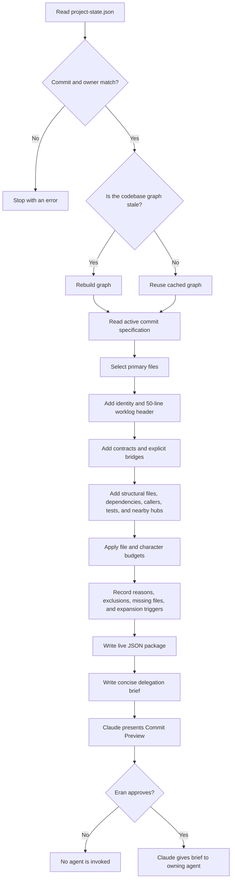

# Context Package Guide

## The 60-Second Version

When you run `/next-step`:

1. Claude finds the next commit and its owner.
2. A script builds a small list of files the agent should understand.
3. The list includes work files, contracts, boundaries, tests, and nearby dependencies.
4. Claude shows you the plan and waits for approval.
5. After approval, the agent receives the small brief instead of exploring the repository.
6. The agent may search further only when it can explain why.

The result is fewer tokens spent searching and a lower chance of missing an important
contract or touching the wrong part of the project.

---

## The Simple Idea

Before an agent starts a commit, we give it a small, prepared map.

The map answers:

- What is the task?
- Which files may change?
- Which files explain the surrounding system?
- Which files are forbidden?
- What tests prove the work is complete?
- When may the agent search for more context?

The agent receives the useful neighborhood around the task, not the entire codebase.

Think of it like repairing a room in a large building. The worker needs:

- The room being repaired
- The electrical and plumbing plans connected to that room
- The building rules
- Nearby control panels

The worker does not need the plans for every room in the building.

---

## Why We Built It

Without a prepared package, an agent may:

- Read whole folders to understand the project
- Read large files that contain only one relevant section
- Miss an important caller or shared contract
- Explore unrelated code
- Spend many tokens rediscovering information we already know

The context package creates a precise starting point while still allowing careful
expansion when something unexpected happens.

---

## The Two Stored Maps

### 1. Codebase Graph

File:

` .context/index/codebase-graph.json `

This is a network of the project:

- Every indexed source file is a node
- An import between files is an edge
- Files are classified as backend, frontend, AI, DevOps, tests, or config
- Frequently imported files are marked as hubs
- Reverse links show which files depend on another file

Example:

```text
database.py --imports--> config.py
security.py --imports--> config.py
```

This tells the system that changing `config.py` may affect both `database.py` and
`security.py`.

The graph is rebuilt only when source files are newer than the cached graph.

### 2. Context Rules

File:

`hooks/context_rules.json`

These rules describe project knowledge that imports alone cannot discover:

- Agent ownership
- Allowed domains
- Structural files
- Cross-domain contracts
- Maximum files
- Character budget
- Number and distance of hubs

Example:

```text
Frontend login code
        | contract bridge
        v
Backend login route + authentication schema
```

The frontend does not import backend Python files. The explicit bridge tells the
system that they still share an important API contract.

---

## How A Package Is Constructed

The live command is:

```powershell
python hooks/prepare_agent_delegation.py --commit 24 --agent rex
```

It performs these steps:



---

## Selection Order

Files are selected and protected in this order:

1. **Primary files**  
   Files listed in the commit's change table.

2. **Identity and current state**  
   The agent identity plus only the first 50 worklog lines.

3. **Contracts**  
   Schemas, interfaces, specifications, and explicit cross-domain bridges.

4. **Tests**  
   Tests named by the commit or connected to the work.

5. **Structural files**  
   Entry points or wiring files such as `main.py` or `App.tsx`.

6. **Dependencies and callers**  
   Files imported by a primary file and files that import a primary file.

7. **Nearby hubs**  
   At most a small number of important files close to the primary work.

Lower-priority context is excluded first when the budget is full.

---

## Context Budget

Current limits:

| Limit | Value |
|---|---:|
| Maximum selected files | 14 |
| Maximum charged characters per file | 6,000 |
| Maximum total characters | 30,000 |
| Reserved expansion budget | 6,000 |
| Initial usable budget | 24,000 |

A file larger than 6,000 characters is marked **targeted excerpt**.

This means:

```text
Do not read all of manifesto-spec.md.
Search for the named LLM Provider Abstraction section.
```

The remaining 6,000 characters are reserved for unexpected but justified discoveries.

---

## When An Agent May Search More

The selected package is a starting boundary, not a blindfold.

An agent may expand context only when it finds:

- An unresolved symbol
- A missing contract
- A failing test
- Implementation evidence that contradicts the package

Before searching, the agent must state:

```text
Reason: Why more context is required
Target: Exact path or search query
Expected decision: What this should help decide
Tradeoff: Extra context cost versus implementation risk
```

The expansion and result are then recorded in the agent worklog.

The agent must not scan directories merely to "understand the project."

---

## What Happens When You Run `/next-step`

### Before Your Approval

Claude:

1. Reads the current commit and owner.
2. Checks blockers and handoffs.
3. Builds the live context package.
4. Shows you the commit preview.
5. Reports the context size, important files, boundaries, and warnings.
6. Waits for your approval.

Preparing context does not authorize implementation.

### After Your Approval

Claude:

1. Reads the generated delegation brief.
2. Passes that brief to the owning agent.
3. Does not paste every selected file into the prompt.
4. The agent reads the selected files using the given read strategy.
5. The agent implements and tests the commit.
6. Claude verifies changed files against ownership and boundaries.

---

## Full Example: Commit 24

Suppose `project-state.json` says:

```text
Next commit: C24 llm-runtime-config
Owner: Rex
```

Claude runs:

```powershell
python hooks/prepare_agent_delegation.py --commit 24 --agent rex
```

Expected command result:

```text
Delegation brief: .context\delegations\C24-rex.md
Live package: .context\runs\C24-rex-live.json
Graph: cache current
Selected 9 files, ~19796 chars
```

### Expected Commit Preview

```text
## Commit 24 - llm-runtime-config - Rex

Summary:
Prepare the backend dependencies and validated settings required by the upcoming
LLM provider implementation.

Why now:
Nova cannot safely implement the provider service until its dependencies and
runtime configuration are stable.

Changes:
- backend/app/core/config.py
- backend/pyproject.toml
- backend/uv.lock

Context package:
- 9 selected files
- Approximately 19,796 characters
- Cached graph is current
- Primary work: config.py, pyproject.toml, uv.lock
- Contracts: llm.py and the LLM provider specification
- Dependents: database.py and security.py
- Forbidden: frontend, API routes, models, migrations, and .env.example
- No expansion trigger currently blocks implementation

Ready to begin llm-runtime-config (Commit 24, assigned to Rex).
Shall I proceed?
```

### Expected Agent Brief After Approval

```text
Task: C24 llm-runtime-config
Owner: Rex

Primary work:
- config.py - full file
- pyproject.toml - full file
- uv.lock - targeted excerpt only

Supporting context:
- Rex identity
- Rex worklog - first 50 lines only
- llm.py - provider interface contract
- manifesto-spec.md - targeted provider section only
- database.py - depends on config
- security.py - depends on config

Boundaries:
- Do not edit frontend/
- Do not edit backend/app/api/
- Do not edit backend/app/models/
- Do not edit backend/alembic/
- Do not edit .env.example

Execution:
- Read selected files first
- Do not scan folders
- Expand only for an explicit trigger
- Record decisions, corrections, handoffs, tradeoffs, and expansions
- Do not commit
```

Rex then works from this brief instead of starting with an open-ended repository search.

---

## Files Produced

| File | Purpose |
|---|---|
| `.context/index/codebase-graph.json` | Cached project network |
| `.context/runs/CNN-agent-live.json` | Complete explainable package |
| `.context/delegations/CNN-agent.md` | Short brief passed to the agent |
| `.context/telemetry/CNN-agent.json` | Actual reads, searches, writes, and expansions |
| `CONTEXT_METRICS.json` | Tracked Phase B history, one record per commit |
| `constraint-dashboard.html` | Visual measurement dashboard |

These files are local runtime artifacts and are ignored by Git.

`CONTEXT_METRICS.json` and `constraint-dashboard.html` are tracked because they preserve
the measurement history.

---

## Phase B: What The Dashboard Measures

The dashboard has three areas:

### Prepared Next Delegation

Visible as soon as `/next-step` prepares context:

- Commit and agent
- Number of selected files
- Estimated context characters
- Number of targeted excerpts
- Known expansion triggers

### Context Efficiency

Added after the commit is verified:

| Field | Meaning |
|---|---|
| Tokens | Total agent tokens recorded for the commit |
| Package | Selected files and estimated characters |
| Selected used | How many selected files the agent actually read or searched |
| Searches | Number of `Grep` or `Glob` operations |
| Expansions | Unique paths inspected outside the package |
| Boundary | Whether forbidden files remained untouched |

Example:

```text
C24 | Rex | 21,400 tokens | 9 files / 19,796 chars
Selected used: 7/9 (77.8%) | Searches: 1 | Expansions: 0 | Boundary: clean
```

How to interpret it:

- **Low selected use:** the package may contain unnecessary files.
- **Many expansions:** the package may be missing important context.
- **High tokens with a small package:** implementation or debugging was expensive.
- **Forbidden violation:** ownership or delegation boundaries failed.
- **Zero expansions with successful tests:** strong evidence that the package was sufficient.

### Constraint History

The original dashboard table remains:

- Context block present
- Forbidden paths clean
- Tool budget respected
- Overall verification result

---

## Important Safety Rules

- `project-state.json` must match the requested commit and owner.
- Missing or invalid graph data falls back safely.
- Forbidden paths remain forbidden even when they appear in the graph.
- A nearby hub is included only when it is relevant to the primary dependency path.
- The whole graph is never sent to an agent.
- The agent cannot commit.
- Your approval is still required before the agent begins.

---

## One-Sentence Explanation

The context package turns the active commit into a small, explainable map of the files,
contracts, boundaries, and nearby dependencies an agent needs, then allows additional
search only when real evidence justifies the extra token cost.
