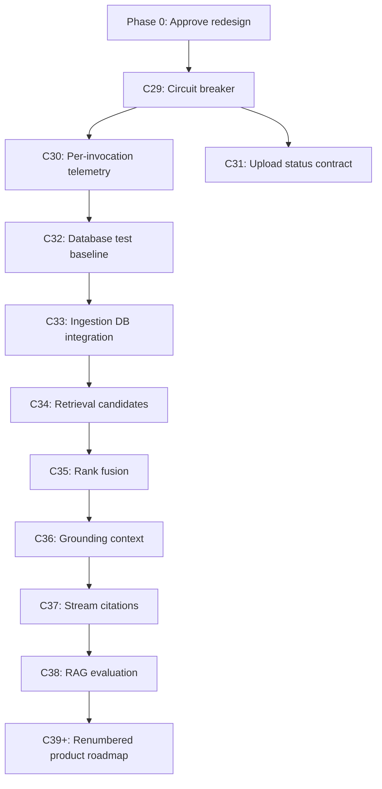

# Multi-Agent Workflow Redesign Roadmap

**Project:** Manifesto
**Owner:** Eran Mani
**Status:** Redesign contract approved by Eran on 2026-06-10; C29 specification drafted
**Created:** 2026-06-10
**Evidence window:** Commits C26-C28 and Claude Code Insights through 2026-06-10

---

## 1. Purpose

This document is the single planning source for redesigning Manifesto's Claude Code
multi-agent workflow after the C26-C28 token-cost failure.

It organizes the redesign in three ways:

1. **Priority phases** - what must happen first and why.
2. **Subsystem workstreams** - which parts of the workflow change together.
3. **Numbered commits** - the proposed implementation sequence after approval.

This roadmap authorizes preparation of the redesigned commit specifications and pending
roadmap renumbering. It does not authorize hook or application implementation. Each
implementation commit still requires its own approved spec.

---

## 2. Executive Decision

Product development stops after C28 until the workflow has a real commit-level circuit
breaker.

The context-package system is useful and should be retained. The urgent defect is that
the current 25-tool cap resets for every agent invocation. Claude can therefore invoke
the same agent repeatedly for one oversized commit, turning a nominal cap into an
unbounded commit cost.

The redesign must make scope failure an execution outcome:

- An oversized commit is rejected before delegation.
- An agent at risk of exceeding its budget returns `SPLIT_REQUIRED`.
- Claude proposes a new numbered micro-commit for the unfinished work.
- Eran approves roadmap changes before execution continues.
- A budget failure cannot be waived so the same commit can continue.

---

## 3. Verified Failure Evidence

### 3.1 Cost

| Commit | Recorded tokens | Implementor invocations | Recorded implementor calls | Outcome |
|---|---:|---:|---:|---|
| C26 | 102,587 | 2 Rex | 51 | Two near-cap invocations |
| C27 | 174,687 | 2 Nova plus gates | 53 combined in worklog | Budget failure accepted |
| C28 | 348,889 | 5 Rex plus gates | 131 in token record; 116 in telemetry | Budget failure accepted |

Real totals are higher because orchestrator token usage is not fully measured.

### 3.2 Root causes

- C26-C29 were marked `fits_single_agent: true` despite broad feature scope.
- The tool counter is reset by `hooks/tool_cap_start.py` before every Agent call.
- `hooks/tool_cap_end.py` clears invocation state after every Agent call.
- `verify_constraints.py` detects budget failure after work has already been performed.
- D34 and D35 allowed failed budgets to proceed as documented overflows.
- A research-only invocation could be followed by another full-cost invocation.
- The context package allowed up to 14 files and about 24,000 usable characters.
- Telemetry stores inconsistent commit totals and overwrites invocation detail.
- Review gates missed C28's status contract violation:
  new upload must return HTTP 201; duplicate upload must return HTTP 200.
- `CLAUDE.md` is truncated inside its execution-constraints block.

### 3.3 External evidence

Claude Code Insights report:

`C:\Users\eranm\.claude\usage-data\report.html`

The report independently identifies sub-agents exhausting tool caps and recommends
smaller, focused agent tasks. It supports the diagnosis but is not the source of truth
for repository-specific totals.

---

## 4. Design Principles

1. **Budget the commit, not only the invocation.**
2. **Reject oversized work before context preparation.**
3. **Treat incomplete scope as a planning event, not permission to continue.**
4. **Keep normal commits sequential: C29, C30, C31. No C29a or fractional IDs.**
5. **One primary behavior and one owner per commit.**
6. **Tests ship with the behavior they prove.**
7. **Telemetry is evidence, not the enforcement mechanism.**
8. **Missing enforcement data fails closed for continuation.**
9. **Agents may propose decomposition but may not change governance or numbering.**
10. **Reviewers receive the diff and relevant contracts, not a full implementor package.**
11. **Claude does not complete an implementor's oversized unfinished feature directly.**
12. **Every automated rejection must explain what failed and what action is allowed next.**

---

## 5. Target Micro-Commit Contract

Every new commit specification must contain:

```yaml
execution_budget:
  max_primary_files: 2
  max_changed_files: 4
  max_context_files: 6
  max_context_chars: 15000
  max_estimated_diff_lines: 350
  max_agent_invocations: 1
  max_tool_calls: 18
  max_expansions: 2
  max_implementor_tokens: 45000
```

These are planning and execution limits, not dashboard targets.

Every specification must also contain:

- One primary behavior.
- One owner.
- Exact primary implementation files.
- Focused tests in the same commit.
- One concrete verification command.
- Environment prerequisites.
- Explicit generated-file exceptions, if any.
- A `Not In This Commit` section naming deferred work.
- Acceptance criteria that can be evaluated without interpretation.

Generated files such as lockfiles may be excluded from the changed-file count only when
the spec names the exact path and explains why generation is unavoidable.

---

## 6. Commit-Level Budget States

| State | Implementor tokens | Required behavior |
|---|---:|---|
| Green | 0-35,000 | Continue within all other limits |
| Warning | 35,001-45,000 | Finish current bounded action; no new discovery |
| Hard stop | Above 45,000 | No normal or repair invocation |
| Absolute stop | 60,000 total observable commit tokens | Block implementor, repair, and review activity |

The 60,000 total includes implementor, repair, and review usage that the system can
observe. C30 must improve measurement of orchestrator usage; until then, unknown token
usage must be displayed as unknown rather than treated as zero.

---

## 7. Agentic Scope-Split Protocol

An implementor should not wait for the hard cap to discover that the task is too large.

### 7.1 Checkpoints

- By calls 6-8, normal implementation should have started.
- At call 12, the agent reports budget status.
- By call 16, the agent decides whether all acceptance criteria can be completed by 18.
- Call 18 is the final allowed implementor tool call.
- A third context expansion is blocked.

### 7.2 `SPLIT_REQUIRED` return

If completion is not credible, the agent stops and returns:

```json
{
  "status": "split_required",
  "completed_scope": ["atomic behavior already completed"],
  "remaining_scope": ["unfinished behavior"],
  "reason": "scope_exceeds_budget",
  "suggested_commit_name": "focused-kebab-name",
  "suggested_owner": "nova",
  "required_files": ["path/to/file.py"],
  "acceptance_criteria": ["observable result"],
  "verification_command": "pytest path/to/test.py -q",
  "dependencies": ["C29"],
  "tool_calls": 16
}
```

The normal telemetry Return Contract remains required.

### 7.3 Claude's response

Claude must:

1. Stop the invocation.
2. Inspect whether completed work is independently safe, tested, and atomic.
3. Never finish the oversized feature directly.
4. Draft a new micro-commit spec for the unfinished behavior.
5. Validate the proposed spec before presenting it.
6. Insert it using the next sequential integer and renumber pending work.
7. Present the current-commit disposition and roadmap change to Eran.
8. Continue only after explicit approval.

### 7.4 Two possible outcomes

**Atomic completed subset**

The current commit may finish if its reduced behavior is independently useful, passes its
verification command, and its spec is formally narrowed before approval. Remaining work
becomes the next numbered commit.

**Unsafe or incomplete subset**

The current commit does not land. The working tree is preserved for inspection, the task
is decomposed, and execution resumes only under approved replacement specs.

### 7.5 Authority boundary

The agent may recommend:

- Commit name
- Owner
- Required files
- Acceptance criteria
- Verification command
- Dependencies

The agent may not:

- Edit commit specifications
- Edit the roadmap
- Assign a commit number
- Grant itself another invocation
- Weaken its budget
- Declare its partial work acceptable

---

## 8. Workstreams By Modification Type

### 8.1 Governance And Commit Specifications

**Purpose:** Make scope machine-checkable before delegation.

**Primary artifacts:**

- `CLAUDE.md`
- `ORCHESTRATION.md`
- `commit-protocol.md`
- `team-preferences.md`
- `AGENTS.md`
- `project-state.json`
- `commit-specs/TEMPLATE.md`
- Active and pending `commit-specs/commit-NN.md`

**Required changes:**

- Repair the truncated execution-constraints section.
- Make pre-delegation validation mandatory.
- Replace per-invocation budget language with commit-level rules.
- Document `SPLIT_REQUIRED`.
- Ban budget waivers and full-cost continuation passes.
- Define the narrow repair exception.
- Define sequential renumbering.
- Separate structural verification from actual quality claims.
- Add explicit `Not In This Commit` sections to specs.

**Completion gate:**

The same rule is stated consistently in all authoritative protocol documents, and every
pending spec validates against the template.

### 8.2 Commit-Spec Validator

**Purpose:** Reject impossible work before building a context package.

**Primary artifacts:**

- New `hooks/validate_commit_spec.py`
- New `hooks/tests/test_validate_commit_spec.py`

**Validation rules:**

- Filename, heading, protocol number, owner, and project state agree.
- Commit IDs are integers with no ordinary letter or fractional suffix.
- Required budget keys exist and do not exceed the locked limits.
- One owner and one primary behavior are declared.
- At most two primary files are listed.
- At most four changed files are predicted, after exact generated exceptions.
- Estimated diff is at most 350 lines.
- Tests, verification command, prerequisites, and exclusions exist.
- Wildcard file ownership and vague entries such as "related files" are rejected.
- Dependency references point to existing or planned commits.

**Output:**

Machine-readable and human-readable results:

```json
{
  "status": "split_required",
  "commit": "C34",
  "violations": [
    {
      "rule": "max_primary_files",
      "actual": 4,
      "limit": 2
    }
  ]
}
```

### 8.3 Agent Hook Circuit Breaker

**Purpose:** Enforce the budget across the entire commit.

**Primary artifacts:**

- `hooks/tool_cap_start.py`
- `hooks/tool_cap_enforce.py`
- `hooks/tool_cap_end.py`
- `hooks/tool_cap.json`, or a replacement commit-state file
- `.claude/settings.json`
- Hook-focused tests

**Required state:**

- Commit ID
- Agent
- Invocation ID and invocation count
- Invocation type: `normal`, `repair`, or `review`
- Tool-call count
- Write-started flag
- Expansion count
- Known token totals
- Stop reason
- Repair authorization and failing command

**Behavior:**

- The first normal invocation consumes the one normal-invocation allowance.
- Ending an invocation does not erase commit totals.
- A second normal invocation is blocked.
- A research-only first invocation cannot be followed by another full invocation.
- A repair requires a failing verification command and a delta brief under 6,000 chars.
- Repair may not restart discovery or reread the original package.
- Hook parse or state-write failures block continuation rather than silently resetting.

### 8.4 Context Package

**Purpose:** Preserve focused starting context while aligning it with micro-commit limits.

**Primary artifacts:**

- `hooks/prepare_agent_delegation.py`
- `hooks/context_engine.py`
- `hooks/context_rules.json`
- `CONTEXT_PACKAGE_GUIDE.md`
- Context-engine and delegation tests

**Required changes:**

- Validate the spec before graph refresh, package generation, telemetry initialization, or
  dashboard writes.
- Reduce the package to at most six files and 15,000 estimated characters.
- Distinguish primary files from supporting contracts.
- Reject a package that exceeds the spec budget; do not silently trim required contracts.
- Add execution budget and checkpoint instructions to the brief.
- Add the `SPLIT_REQUIRED` return schema.
- Generate a delta brief for an authorized repair, capped below 6,000 characters.
- Keep expansion reasons explicit and machine-counted.

**Important constraint:**

Context selection cannot certify that a feature is small enough. Spec validation owns
scope approval; context packaging starts only after that approval.

### 8.5 Telemetry And Accounting

**Purpose:** Make every invocation visible and reconcile contradictory sources.

**Primary artifacts:**

- `hooks/context_telemetry.py`
- `hooks/context_metrics.py`
- `CONTEXT_METRICS.json`
- `TOKEN_RECORDS.md`
- `.context/telemetry/`
- Telemetry tests

**Required changes:**

- Store each invocation as a separate immutable record.
- Aggregate calls and tokens by commit.
- Preserve normal, repair, and reviewer invocation types.
- Derive expansions from actual read paths when available.
- Compare hook counts, agent reports, worklogs, and token records.
- Mark contradictions explicitly instead of selecting one silently.
- Record orchestrator tokens when the runtime exposes them.
- Never interpret missing data as zero.

**Deferred relationship:**

Telemetry improves trust but does not replace C29 enforcement. It follows the circuit
breaker so the next oversized commit is stopped rather than merely measured.

### 8.6 Verification And Quality Gates

**Purpose:** Catch contract failures without reopening broad discovery.

**Primary artifacts:**

- `hooks/verify_constraints.py`
- `.claude/commands/verify-commit.md`
- Gate instructions and reviewer briefs
- Constraint and dashboard tests

**Required changes:**

- Re-run spec validation during worktree and post-commit verification.
- Validate actual changed-file and diff-line counts.
- Treat absent budget evidence as failure for implementor commits.
- Make budget failure non-waivable.
- Distinguish structural checks from tests and behavioral review.
- Feed reviewers the diff, acceptance criteria, and contracts only.
- Require contract-focused regression tests for status codes, defaults, and error shapes.

**Known regression target:**

C31 must establish:

- New document upload returns HTTP 201.
- Duplicate identical ready document returns HTTP 200.

### 8.7 Roadmap And Renumbering

**Purpose:** Convert rejected scope into clean sequential work.

**Primary artifacts:**

- `commit-protocol.md`
- `project-state.json`
- Pending commit specs
- Agent worklog handoffs

**Required behavior:**

- No automatic semantic split is applied without Eran's approval.
- Claude drafts the split from validator output or `SPLIT_REQUIRED`.
- New work uses the next sequential integer.
- Pending specs are renumbered transactionally using temporary names.
- Headings, filenames, dependencies, handoffs, state, and protocol rows move together.
- The full pending graph validates before the renumber is accepted.
- Historical completed commit IDs never change.

### 8.8 Dashboard And Operator Experience

**Purpose:** Make stop conditions obvious to Eran and Claude.

**Primary artifacts:**

- `hooks/constraint_dashboard.py`
- `hooks/render_constraint_dashboard.py`
- `constraint-dashboard.html`

**Required views:**

- Commit budget state: green, warning, hard stop, absolute stop.
- Invocation ledger rather than one flattened total.
- Normal versus repair invocation.
- Tool calls, expansions, tokens, and changed files against limits.
- Telemetry contradictions.
- Split requested, split approved, or blocked state.
- Exact reason delegation or continuation was rejected.

Dashboard work follows telemetry normalization. It must not be on C29's critical path.

### 8.9 Environment Preflight

**Purpose:** Prevent environment debugging from consuming implementation budgets.

**Checks before delegation:**

- Required runtime and dependency availability.
- Correct working directory.
- Verification command can start.
- Required database/container service is reachable.
- Known host-port conflict procedure is selected.
- Writable paths exist.

Environment failure stops before the agent is invoked. It becomes infrastructure work or
a separately approved blocker commit, not additional discovery inside a product commit.

---

## 9. Priority Phases

### Phase 0 - Freeze And Approve The Design

**Priority:** Immediate
**Product commits:** Blocked
**Status:** Approved 2026-06-10

Approved decisions:

- This roadmap is the redesign planning authority.
- C29 receives a one-time atomic bootstrap exception.
- The budget values in Section 5 are locked for the C29 specification.
- Agents may return `SPLIT_REQUIRED`; Claude drafts the split; Eran approves it.
- Pending product work will use the sequential C29-C43 roadmap.

Exit criteria:

- No unresolved design decision affects the C29 spec.
- C29 can be written as a precise implementation contract.

### Phase 1 - Stop The Bleeding

**Priority:** Critical

#### C29 - `agent-budget-circuit-breaker`

Installs:

- Spec template and pre-delegation validator.
- Commit-level invocation state.
- 18-call hard cap and two-expansion cap.
- One normal invocation rule.
- Agentic `SPLIT_REQUIRED` return.
- Narrow repair authorization.
- Non-waivable budget failures.
- Reduced context limits.
- Protocol repair, including the truncated `CLAUDE.md`.

Exit criteria:

- An invalid or oversized spec cannot generate a delegation.
- A second normal invocation for the same commit is blocked.
- A valid split request reaches Claude with enough information to draft a new spec.
- All hook tests pass.

### Phase 2 - Restore Measurement Trust

**Priority:** High

#### C30 - `telemetry-per-invocation`

Installs:

- Immutable invocation records.
- Commit aggregation.
- Contradiction detection.
- Expansion derivation.
- Orchestrator-token support when available.
- Dashboard invocation ledger.

Exit criteria:

- C26-C28 can be represented without flattening or overwriting invocations.
- Contradictory totals are displayed and fail reconciliation checks.

### Phase 3 - Restore Product And Test Trust

**Priority:** High

#### C31 - `document-upload-status-contract`

- Duplicate upload returns HTTP 200.
- New upload returns HTTP 201.
- Regression tests enforce both branches.

#### C32 - `database-test-baseline`

- Fix OI-11.
- Standardize Docker database test commands.
- Establish the required full-backend-suite command.

#### C33 - `ingestion-database-integration`

- Replace the permanently skipped C27 integration placeholder.
- Verify real pgvector insertion.
- Verify document status transitions and rollback behavior.

Exit criteria:

- Full backend suite has a documented green execution path.
- Upload status behavior matches the specification.
- Ingestion has a real database integration gate.

### Phase 4 - Build Policy RAG Surgically

**Priority:** Medium after Phases 1-3

The old C29 feature epic becomes:

#### C34 - `policy-retrieval-candidates`

- Normalize query.
- Embed query.
- Fetch profile-filtered vector and lexical candidate sets.
- Excludes rank fusion, prompt construction, streaming, and evaluation.

#### C35 - `policy-rank-fusion`

- Reciprocal-rank fusion.
- Deterministic ordering.
- Document and adjacency diversification.
- Excludes prompt construction and generation.

#### C36 - `policy-grounding-context`

- Evidence threshold.
- Token-budgeted context selection.
- Stable source labels.
- Injection-resistant prompt construction.
- Excludes streaming transport.

#### C37 - `policy-stream-citations`

- Provider-neutral event stream.
- Citation-label validation.
- Cancellation and failure semantics.
- Excludes offline evaluation dataset.

#### C38 - `policy-rag-evaluation`

- Versioned evaluation dataset.
- Retrieval hit rate and MRR.
- Abstention and citation validity.
- Context-size and latency baselines.

Exit criteria:

- Each RAG behavior fits the micro-commit contract independently.
- Each commit has focused tests and one verification command.

### Phase 5 - Resume Renumbered Product Roadmap

**Priority:** Normal

Existing pending product commits move after C38:

| New number | Existing planned work |
|---|---|
| C39 | policy-chat-routes |
| C40 | conversation-persistence |
| C41 | policy-chat-ui |
| C42 | conversation-sidebar-ui |
| C43 | citations-ui |

Every renumbered spec must be revalidated. Renumbering does not prove that these commits
already satisfy the new size limits; any oversized item must be split again.

---

## 10. Dependency Map



C31 may run after C29 without waiting for C30, but C32-C33 should use the normalized
telemetry and environment procedure where practical.

---

## 11. Proposed C29 Bootstrap Exception

C29 necessarily changes more than four files because enforcement spans governance,
delegation, hook state, validation, and tests. Splitting it incorrectly could install a
validator without preventing repeated invocations, or install a hook without an
authoritative spec contract.

Recommended exception:

```yaml
bootstrap_exception:
  reason: "Atomic installation of the workflow circuit breaker"
  applies_to_commit: 29
  relaxed_limits:
    max_changed_files: 18
    max_estimated_diff_lines: 3200
  unchanged_limits:
    max_primary_behaviors: 1
    max_agent_invocations: 1
    max_tool_calls: 18
    max_implementor_tokens: 45000
  expires_after_commit: 29
```

Conditions:

- The exception is exact, temporary, and machine-validated.
- It does not permit product-code edits.
- C29 still has one behavior: prevent oversized repeated execution.
- Generated dashboard/state outputs are listed separately.
- No later commit may reuse the exception.

Alternative:

Split governance, validator, and hook state across multiple numbered commits. This is
cleaner by file count but unsafe unless product execution remains frozen until every part
is installed. The recommended approach is the one-time atomic bootstrap exception.

---

## 12. Test Strategy

### 12.1 Validator tests

- Valid template passes.
- Missing required section fails.
- Each numeric limit overflow fails.
- Weakened budget values fail.
- Multiple owners or behaviors fail.
- Generated exception without exact path and reason fails.
- Filename, heading, state, and protocol mismatches fail.
- Dependency to a missing commit fails.

### 12.2 Delegation tests

- Validation runs before graph refresh or output writes.
- Rejected specs create no package, brief, telemetry, or dashboard mutation.
- Packages above six files fail.
- Packages above 15,000 characters fail.
- Brief includes budget checkpoints and `SPLIT_REQUIRED`.
- Repair brief is below 6,000 characters and contains no discovery package.

### 12.3 Circuit-breaker tests

- First normal invocation starts.
- Second normal invocation is blocked.
- Commit totals survive invocation end.
- Call 12 produces a warning.
- Call 19 is blocked.
- Third expansion is blocked.
- Research-only completion cannot authorize continuation.
- Repair requires a recorded failing command.
- Repair is allowed once and cannot reopen discovery.
- Missing or corrupt state fails closed for continuation.
- 45,000 implementor tokens block repair.
- 60,000 observable total tokens block review and repair.

### 12.4 Verification tests

- Missing budget evidence fails for an implementor.
- Actual changed-file overflow fails.
- Actual diff-line overflow fails.
- A budget failure cannot become warning/pass through configuration.
- Structural verification labels do not imply behavioral correctness.

### 12.5 Renumbering tests

- C29-C34 can move to C34-C43 without filename collision.
- Headings, dependencies, state, handoffs, and protocol rows remain consistent.
- Completed commits remain unchanged.
- Failed graph validation rolls back the proposed renumber.

### 12.6 Regression commands

Primary hook suite:

```powershell
python -m pytest hooks/tests -q
```

Later database baseline:

```powershell
docker compose run --rm backend uv run pytest -q
```

---

## 13. Rollout And Migration

1. Approve this roadmap and unresolved decisions.
2. Replace the current C29 product spec with the circuit-breaker spec.
3. Renumber pending specs and protocol rows in one planned migration.
4. Implement C29 under the bootstrap exception.
5. Run hook tests and simulated rejected-delegation scenarios.
6. Use one synthetic valid micro-spec to prove normal delegation.
7. Use one synthetic oversized spec to prove pre-delegation rejection.
8. Use one synthetic `SPLIT_REQUIRED` return to prove spec-drafting flow.
9. Only then resume C30 and later work.

Historical C26-C28 records should not be rewritten to appear compliant. C30 may migrate
their telemetry representation while preserving the original evidence and contradictions.

---

## 14. Explicit Non-Goals

- Replacing the deterministic codebase graph with embeddings.
- Letting an agent autonomously commit or renumber work.
- Automatically accepting an LLM-generated split without Eran's approval.
- Solving all telemetry accuracy issues inside C29.
- Redesigning the application architecture.
- Implementing policy RAG before workflow enforcement is active.
- Using review agents as a substitute for focused regression tests.
- Treating a larger context window as permission for a larger commit.

---

## 15. Open Decisions Requiring Approval

| Decision | Recommendation |
|---|---|
| C29 bootstrap exception | Approved: one-time atomic exception |
| Hard limits | Approved: values in Section 5 |
| Warning checkpoints | Approved: calls 12 and 16 |
| Repair allowance | Approved: one narrow repair only |
| Repair delta brief | Approved: maximum 6,000 characters |
| Budget failure policy | Approved: non-waivable |
| Missing state behavior | Approved: fail closed for continuation |
| Agent split authority | Approved: proposal only; Claude drafts; Eran approves |
| Pending roadmap numbering | Approved: C29-C43 as listed |
| Product freeze | Approved: active through C29 completion |

---

## 16. Definition Of Redesign Complete

The redesign is complete when:

- Every pending spec validates before delegation.
- No normal commit can receive two full implementor invocations.
- An agent can request decomposition before exhausting its cap.
- Claude can turn that request into an approved sequential micro-commit.
- Context packages stay within six files and 15,000 characters.
- Tool, expansion, invocation, and token limits are enforced at commit level.
- Telemetry stores every invocation and exposes contradictions.
- Budget failures cannot be waived.
- Review briefs are bounded to diffs and contracts.
- The full backend test procedure is documented and green.
- Product work resumes through independently testable micro-commits.

---

## 17. Related Documents

- `CLAUDE.md` - boot sequence and abbreviated commit loop
- `ORCHESTRATION.md` - authoritative workflow rules
- `AGENTS.md` - roster, domains, and communication protocol
- `commit-protocol.md` - numbered build sequence
- `CONTEXT_PACKAGE_GUIDE.md` - current context-package design
- `workflow-optimization-report.md` - earlier optimization analysis
- `DECISIONS.md` - historical decisions, including D29-D36
- `TOKEN_RECORDS.md` - recorded invocation and commit token totals
- `CONTEXT_METRICS.json` - context and telemetry records
- `C:\Users\eranm\.claude\usage-data\report.html` - Claude Code Insights report

---

## 18. Change Control

Changes to this roadmap require Eran's approval before they alter implementation order,
budget values, authority boundaries, or product-freeze status.

When C29 begins, its approved commit specification becomes the implementation contract.
This roadmap remains the cross-phase design and sequencing reference.
